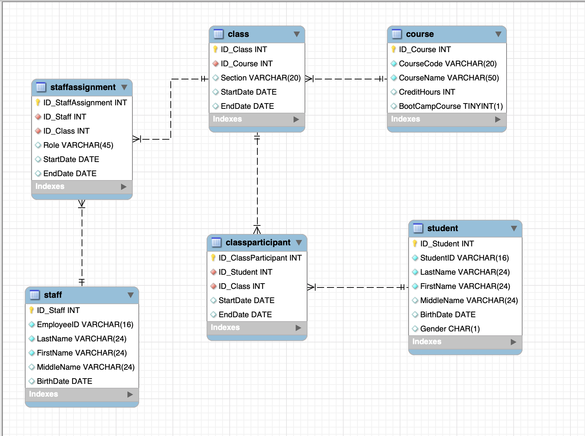
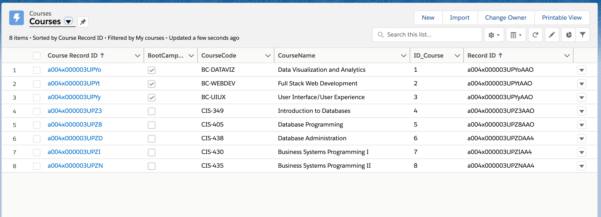

# ETL-project

The goal for this project is to migrate data from a cloud MySQL database, hosted on Amazon Web Services (AWS) to a Salesforce application that I will build. To start the ETL process, I produced an entity relationship diagram (ERD) from MySQL workbench to illustrate the database structure. Then, on the Salesforce platform, I built a Student Information System that reflects the same database structure. After that, I developed an ETL process in Python that loads each of the tables in Salesforce from your MySQL database on AWS. 

## Step 1 - Database Setup

Ensure that your MySQL database has been set up and that the GWSIS objects have been created. 

## Step 2 - Salesforce Trails

Complete the following trails on Salesforce to familiarize myself with the platform:
* Platform Development Basics: https://trailhead.salesforce.com/content/learn/modules/platform_dev_basics
* Data Modeling: https://trailhead.salesforce.com/en/content/learn/modules/data_modeling

## Step 3 - Salesforce Application Setup

Build a Student Information System on the Salesforce platform and design the architecture for the system.

Include the following tables:
* Student
* Course
* Class
* Class Participant
* Staff
* Staff Assignment

Produce an entity relationship diagram (ERD) from MySQL workbench to illustrate the database structure.

## Step 4 - Data Movement (ETL)

Develop an ETL process in Python that loads each of the tables in Salesforce from your MySQL database on AWS.

